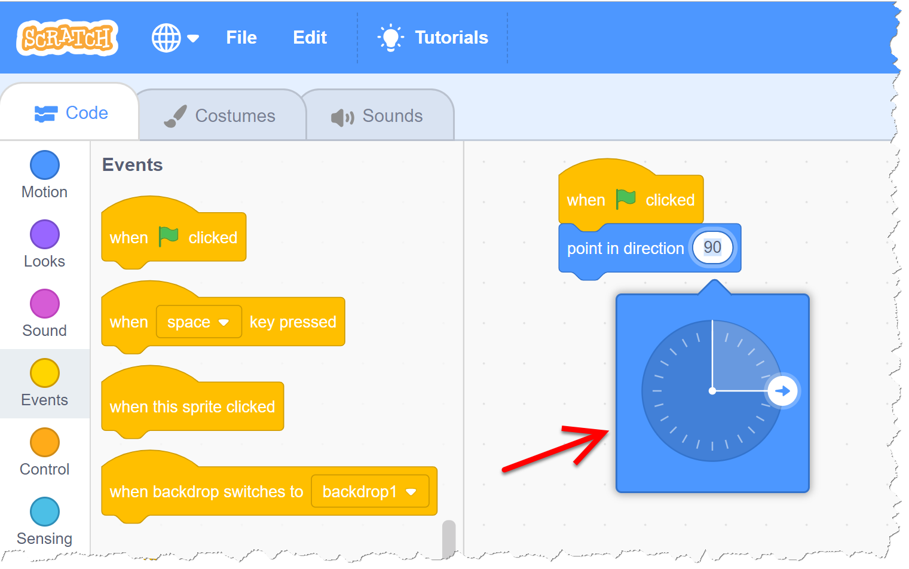

# Angular Sample

## Introduction

[Rainer Stropek](http://rainerstropek.me) created this sample for advanced Angular trainings.

## Recap

We use this step to recap some fundamentals of software development with Angular.

* Create a new Angular app with the [*Angular CLI*](https://cli.angular.io/).
  * The app has to contain routing.
  * Use [*SCSS*](https://sass-lang.com/) for styling.

* Add the libraries [*Angular Material*](https://material.angular.io/), [Angular Flex-Layout](https://github.com/angular/flex-layout), and [*ngx-popper*](https://github.com/MrFrankel/ngx-popper) to your app.

* Add a [menu bar](https://material.angular.io/components/menu/overview) ([*app.component.html*](src/app/app.component.html)).
  * Add some styling to the menu bar ([*app.component.scss*](src/app/app.component.scss)).
  * Speak about [component styles](https://angular.io/guide/component-styles).

## Router

* Add two demo components ([*multi-level-router.components.ts](src/app/multi-level-router/multi-level-router.component.ts)).
  * The first one (level 1) contains a `router-outlet`.
  * Add route with child route to new components to [*app-routing.module.ts*](src/app/app-routing.module.ts).
  * Speak about [various router features](https://angular.io/guide/router), in particular [routing modules](https://angular.io/guide/router#milestone-2-routing-module) and [child routes](https://angular.io/guide/router#child-route-configuration).

* Add menu items for demo components to [menu bar](https://material.angular.io/components/menu/overview) ([*app.component.html*](src/app/app.component.html)).

* Now we want to implement a [*breadcrumb navigation*](https://en.wikipedia.org/wiki/Breadcrumb_(navigation)) component.
  * Implement [*breadcrumb.component.ts*](src/app/breadcrumb/breadcrumb.component.ts).
  * Speak about [router events](https://angular.io/guide/router#router-events) and how to use [RxJS](https://rxjs-dev.firebaseapp.com/) with it.
  * Implement UI in [*breadcrumb.component.html*](src/app/breadcrumb/breadcrumb.component.html) and [*breadcrumb.component.scss*](src/app/breadcrumb/breadcrumb.component.scss).
  * Describe [CSS *@imports*](https://angular.io/guide/component-styles#css-imports) based on color include file [*colors.scss*](src/colors.scss).

* Add breadcrumb navigation to ([*app.component.html*](src/app/app.component.html) and test it with demo components.

## Jasmine

We want to write automated tests for our breadcrumb navigation with [Jasmine](https://jasmine.github.io/tutorials/your_first_suite).

* Implement [*breadcrumb.component.spec.ts*](src/app/breadcrumb/breadcrumb.component.spec.ts).

* Speak about [Jasmine](https://jasmine.github.io/tutorials/your_first_suite) in general and [Angular testing](https://angular.io/guide/testing) in particular.

* Describe [dependency providers](https://angular.io/guide/dependency-injection-providers#dependency-providers) and how they are used in the test.

## Angle Selector - Static HTML

Next, we want to implement a reusable component for selecting angles. This sample has been inspired by [Scratch's](https://scratch.mit.edu) angle picker:

* We will implement multiple version of the the angle picker. So generate a separate module [*angle-selector.module.ts*](src/app/angle-selector/angle-selector.module.ts) for it with the [*Angular CLI*](https://cli.angular.io/).
  * Speak about [Angular modules](https://angular.io/guide/architecture-modules).

* Generate a new component *angle-selector/angle-selector-static* for an implementation of the angle selector in static HTML ([*angle-selector-static.component.html*](src/app/angle-selector/angle-selector-static/angle-selector-static.component.html) and [*angle-selector-static.component.scss*](src/app/angle-selector/angle-selector-static/angle-selector-static.component.scss)).
  * Code walkthrough ([*angle-selector-static.component.html*](src/app/angle-selector/angle-selector-static/angle-selector-static.component.html)
  * Speak about fundamentals of [SVG](https://developer.mozilla.org/en-US/docs/Web/SVG) if necessary.

* Add static HTML verion to [routing](https://angular.io/guide/router) and [menu bar](https://material.angular.io/components/menu/overview).

## Angle Selector - Basic Component

* Generate a new component [*angle-selector/angle-selector-basic*](src/app/angle-selector/angle-selector-basic).

* Copy the HTML/SCSS from [*angle-selector-static.component.html*](src/app/angle-selector/angle-selector-static/angle-selector-static.component.html) and [*angle-selector-static.component.scss*](src/app/angle-selector/angle-selector-static/angle-selector-static.component.scss).

* Add an [input binding](https://angular.io/guide/component-interaction#pass-data-from-parent-to-child-with-input-binding) with which the angle can be set from outside.

* Add a test component [*AngleSelectorBasicHostComponent*](src/app/angle-selector/angle-selector-basic/angle-selector-basic.component.ts) where the user can enter an angle in an [`input`](https://material.angular.io/components/input/overview) and that angle is bound to our component's input.

* Create (or [copy](src/app/angle-selector/angle-selector-basic/angle-selector-basic.component.ts)) the necessary business logic to dynamically adjust the [SVG](https://developer.mozilla.org/en-US/docs/Web/SVG).
  * Speak about [data binding details, in particular attribute binding](https://angular.io/guide/template-syntax#attribute-class-and-style-bindings).

* Implement [automated tests](src/app/angle-selector/angle-selector-basic/angle-selector-basic.component.spec.ts) for the component.
  * Describe difference between [component class tests and component DOM tests](https://angular.io/guide/testing#component-test-basics)

## Angle Selector - More Advanced Implementation

The next version of our component should allow the user to manipulate the angle by dragging the arrow with the mouse.

* Generate a new component [*angle-selector/angle-selector-pointer*](src/app/angle-selector/angle-selector-pointer).

* Copy the HTML/SCSS/TS code from [*angle-selector/angle-selector-basic*](src/app/angle-selector/angle-selector-basic).

* Add an *input* and an [output binding](https://angular.io/guide/component-interaction#parent-listens-for-child-event) for the maintenance of the *angle* value.
  * Speak about [custom two-way binding](https://angular.io/guide/template-syntax#two-way-binding---).
  * Describe *input* binding [to a setter](https://angular.io/guide/component-interaction#intercept-input-property-changes-with-a-setter) vs. [`OnChanges`](https://angular.io/guide/lifecycle-hooks#onchanges).

* Add [drag-and-drop logic](src/app/angle-selector/angle-selector-pointer/angle-selector-pointer.component.ts).
  * Describe [`@ViewChild`](https://angular.io/guide/component-interaction#parent-calls-an-viewchild) and [`ElementRef`](https://angular.io/guide/glossary#element).
  * Speak about [`@HostListener`](https://angular.io/guide/attribute-directives#respond-to-user-initiated-events).

* Add a test component [*AngleSelectorPointerHostComponent*](src/app/angle-selector/angle-selector-pointer/angle-selector-pointer.component.ts) where the user can enter an angle in an [`input`](https://material.angular.io/components/input/overview) and that angle is two-way-bound to our component's input/output.

* Implement [automated tests](src/app/angle-selector/angle-selector-pointer/angle-selector-pointer.component.spec.ts) for the component.
  * Describe [`DebugElement`](https://angular.io/guide/testing#debugelement)
  * Describe [`dispatchEvent`](https://angular.io/guide/testing#change-an-input-value-with-dispatchevent)

