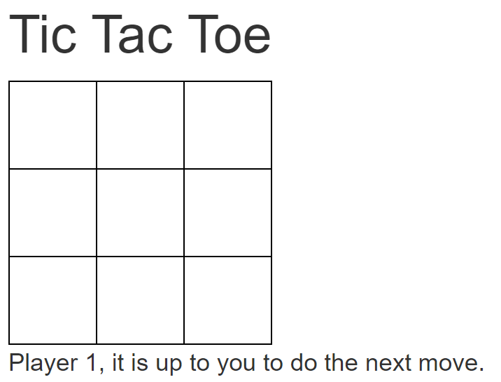

# Tic Tac Toe Lab

## Your First Task

Implement a RESTful Web API with Node.js that can detect a winner in a 3 x 3 tic tac toe bord. The web api must have the following features:

* Listen to HTTP POST requests on path `/checkForWinner`.

* Accept array with nine numeric elements each representing a cell in the tic tac toe board. Each cell can have one of the following values:
  * `0` means *cell is not set*
  * `1` means *player 1*
  * `2` means *player 2*

* If the web api detects a winner, it has to return status code 200 with a result looking like this: `{ "winner": 1 }` (`1` would mean *player 1*).

* If the web api does not detect a winner, it has to return 204 (no content).

* Implement at least basic parameter checking for the input parameter. You have to return 400 (bad request) in the following cases:
  * Body of POST request is empty.
  * Body of POST request does not contain an array.
  * Body of POST request contains an array with an invalid number of elements (must have nine elements = cells).

* Try Visual Studio Code's debugger for Node.js.

## Tips

* Implement everything with TypeScript, not JavaScript.

* Use the NPM packages `express`, `cors`, and `body-parser` to implement the web api.

* Install Visual Studio Code's *REST Client* extension. Try the sample requests in [sample-requests.http](sample-requests.http).

## Your Second Task

* Make yourself familiar with the *Jasmine* testing framework ([introduction](https://jasmine.github.io/edge/introduction), [using Jasmine with Node.js](https://jasmine.github.io/edge/node.html)).

* Write unit tests for your winner detection business logic. Examples for acceptance criteria:
  * `[ 0, 0, 0, 1, 1, 1, 2, 2, 0 ]` -> winner is 1
  * `[ 1, 0, 0, 1, 0, 0, 1, 0, 0 ]` -> winner is 1
  * `[ 1, 0, 0, 0, 1, 0, 0, 0, 1 ]` -> winner is 1
  * `[ 0, 0, 1, 0, 1, 0, 1, 0, 0 ]` -> winner is 1
  * `[ 0, 0, 0, 0, 0, 0, 0, 0, 0 ]` -> no winner

## Your Third Task

* Make yourself familiar with async support of *Jasmine* (look at chapter *Asynchronous Support* in [Jasmin docs](https://jasmine.github.io/edge/introduction)).

* Write a test suite that...
  * ...starts an instance of the web api before running tests.
  * ...sends requests to that web api.
  * ...validate the results.

* Examples for acceptance criteria:
  * `[0, 0, 0, 1, 1, 1, 2, 2, 0]` -> status code is 200, winner is 1
  * `[0, 0, 0, 0, 0, 0, 0, 0, 0]` -> status code is 204
  * `[0, 0]` -> status code is 400

## Tips

* Use the NPM package `request` to do web api requests in your unit tests.

## Your Final Task

* Implement a frontend using Angular 2. It should look something like this: 
  

* Players should do their moves one after the other. If player 1 has one cell, it should turn blue. The cells of player 2 should be red.

* Use the web api you implemented before to detect whether there is a winner. If there is a winner, show a message and allow the players to restart the game. 
  

